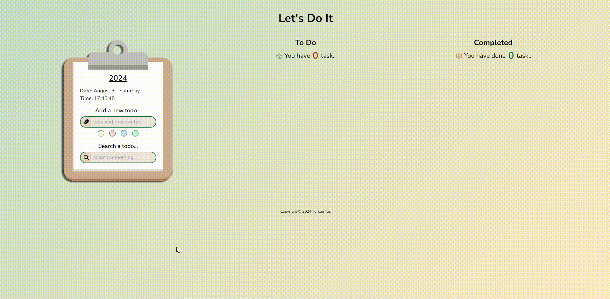
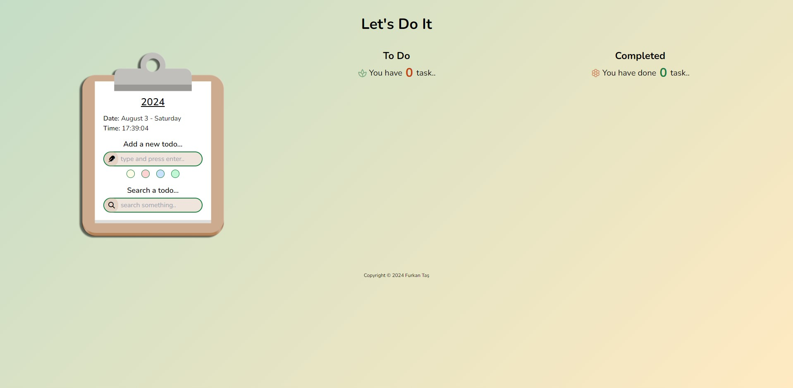
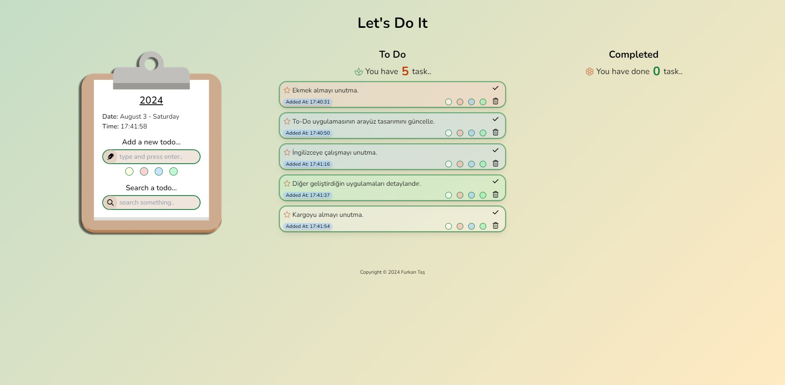
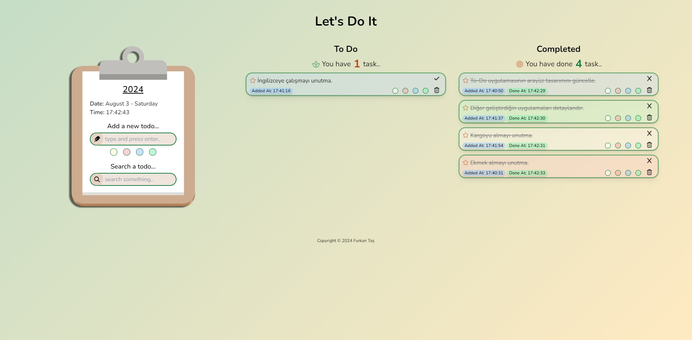

# Let's Do It - To-Do List Application

🟩 **Live Demo:** <a href="https://furrkanntas.github.io/02_ToDoApp-LetsDoIt/" target="_blank" rel="noopener noreferrer">Let's Do It - Live Link</a>

🟨 **Other Projects:** <a href="https://furrkanntas.github.io/01_FT-Portfolio/index.html" target="_blank" rel="noopener noreferrer">Explore My Projects</a>

## Overview

Let's Do It is a simple and user-friendly to-do list application developed using HTML, Tailwind CSS, and JavaScript. The application allows users to add, complete, and delete tasks, as well as search through their tasks. Each task can be customized with a color and will be saved in local storage to persist between sessions.

## Features

- **Add Tasks**: Users can add new tasks with customizable background colors.
- **Complete Tasks**: Users can mark tasks as completed, which will move them to the completed section.
- **Delete Tasks**: Users can remove tasks from the list.
- **Search Tasks**: Users can search for tasks by typing in the search bar.
- **Persistent Storage**: Tasks are saved in local storage to ensure they persist between sessions.
- **Dynamic Date and Time**: The application displays the current date and time, updating every second.
- **Responsive Design**: The application adapts to different screen sizes for a seamless experience on both mobile and desktop devices.

## Screenshots

## Demo

Here is a demo of the application in action:

## File Structure

- `index.html`: The main HTML file for the application.
- `app.js`: JavaScript file containing the logic for the application.
- `styles.css`: Custom CSS file for styling the application.
- `public/`: Folder containing images and other assets.

## License

This project is licensed under the MIT License - see the [LICENSE](LICENSE) file for details.

## Acknowledgments

- [Tailwind CSS](https://tailwindcss.com/) for the utility-first CSS framework.
- [Date-fns](https://date-fns.org/) for the date manipulation library.
- [Font Awesome](https://fontawesome.com/) for the icon library.
- [Google Material Symbols](https://fonts.google.com/icons) for additional icons.

## Conclusion

Thank you for checking out the Let's Do It To-Do List Application! We hope this tool helps you stay organized and productive. If you have any questions or suggestions, feel free to open an issue or contribute to the project. Your feedback is greatly appreciated!

Happy organizing!

Best regards,  
**Furkan Taş**

🟩 **Live Demo:** <a href="https://furrkanntas.github.io/02_ToDoApp-LetsDoIt/" target="_blank" rel="noopener noreferrer">Let's Do It - Live Link</a>

🟨 **Other Projects:** <a href="https://furrkanntas.github.io/01_FT-Portfolio/index.html" target="_blank" rel="noopener noreferrer">Explore My Projects</a>